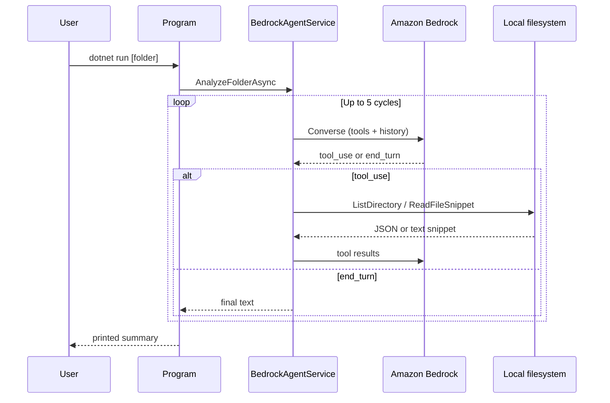

# Bedrock Workspace Explorer

A .NET console app that uses **Amazon Bedrock** (Converse API with tool use) as an autonomous agent to inspect a local folder. The model can list directories and read short file snippets, then returns a structured summary of what the folder contains and what it appears to be for.

## Prerequisites

- [.NET 10 SDK](https://dotnet.microsoft.com/download) (or the SDK version targeted in `BedrockWorkspaceExplorer.csproj`)
- AWS credentials with permission to invoke your chosen Bedrock model (`bedrock:InvokeModel` on the model ARN)
- Model access enabled in the [Bedrock console](https://console.aws.amazon.com/bedrock/) for the region you use

## Configuration

Settings are loaded from `appsettings.json` in the build output directory (copied from the project root on `dotnet build` / `dotnet run`). Environment variables override JSON using `__` nesting (e.g. `Bedrock__ModelId`, `Aws__Profile`).

### First-time setup

1. Copy the template if you do not already have a local file:

   ```bash
   cp appsettings.example.json appsettings.json
   ```

2. Edit `appsettings.json` for your AWS account and preferred model.
3. Optionally create `appsettings.Development.json` or `appsettings.local.json` for machine-specific overrides (these files are gitignored).

### Settings reference

| Setting | Description |
|--------|-------------|
| `Aws:Profile` | Named profile from `~/.aws/credentials`. Leave **empty** to use the [default credential chain](https://docs.aws.amazon.com/sdk-for-net/v3/developer-guide/creds-assign.html) (environment variables, default profile, IAM role, etc.). |
| `Aws:Region` | AWS region for Bedrock calls (e.g. `us-east-1`). Must match where your model is available. |
| `Bedrock:ModelId` | Bedrock model ID for the Converse API. |

### Default model

The repository defaults to **Amazon Nova Micro** (`amazon.nova-micro-v1:0`) — a low-cost, text-only model suitable for directory exploration and tool use. Enable it under **Model access** in the Bedrock console for your region.

### Model alternatives

| Model | ID | Notes |
|-------|-----|--------|
| Amazon Nova Micro (default) | `amazon.nova-micro-v1:0` | Lowest cost; text-only; enable in Bedrock console |
| Claude Haiku 4.5 | `anthropic.claude-haiku-4-5-20251001-v1:0` | Active Anthropic Haiku tier; supports vision |

**Do not use legacy Claude 3 models** (e.g. `anthropic.claude-3-haiku-20240307-v1:0`). AWS marks them as Legacy and returns `ResourceNotFoundException` unless you have used them recently.

Example `appsettings.json`:

```json
{
  "Aws": {
    "Profile": "my-dev-profile",
    "Region": "us-east-1"
  },
  "Bedrock": {
    "ModelId": "amazon.nova-micro-v1:0"
  }
}
```

On startup, the app prints the active AWS profile (or “default chain”), region, and model ID.

## Usage

From the repository root:

```bash
# Analyze this project's source root (default when no path is given)
dotnet run

# Analyze a specific folder
dotnet run -- "C:\path\to\folder"
```

The agent runs a short tool-use loop (list directory, read snippets) and prints the final analysis to the console.

## Project layout

| Path | Role |
|------|------|
| `Program.cs` | Entry point, configuration, AWS client setup |
| `Services/BedrockAgentService.cs` | Bedrock Converse loop and tool orchestration |
| `Tools/AgentTools.cs` | Tool definitions and sandboxed filesystem access |
| `Abstractions/IBedrockAgentService.cs` | Service contract for reuse in other hosts |
| `Configuration/AppSettings.cs` | Strongly typed settings |
| `appsettings.json` | Local AWS and Bedrock settings (safe defaults committed) |
| `appsettings.example.json` | Template to copy for new clones |

## How it works



All filesystem tools resolve paths under the supplied root and reject traversal outside that boundary.

## License

See [LICENSE](LICENSE).
